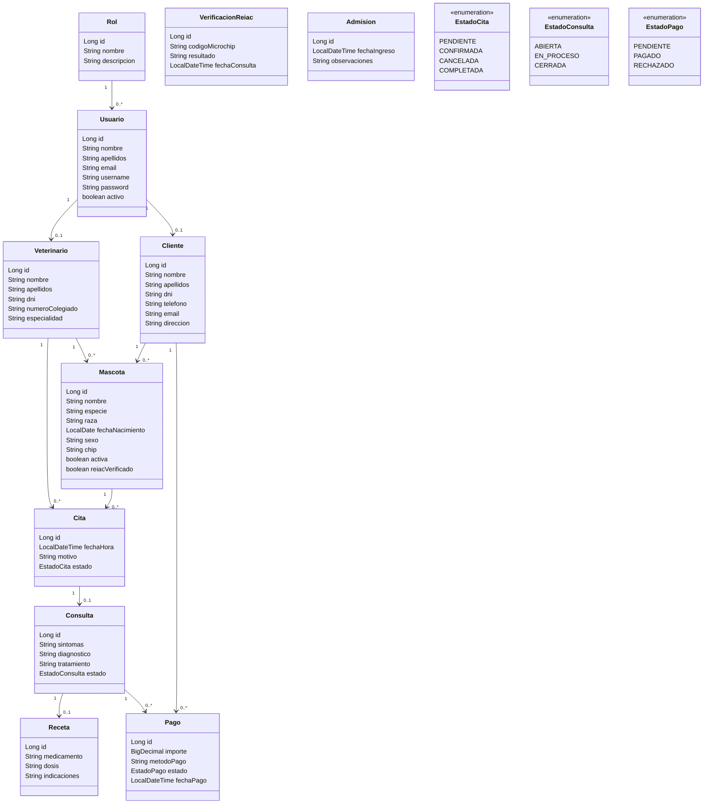

# Diagrama de clases

Responsable documentacion de diseno: David Martinez - G8.

Diagrama simplificado de las entidades principales del proyecto.

## Notas de diseno

- El modelo separa `Usuario` de `Cliente` y `Veterinario` para permitir login solo cuando sea necesario.
- `Mascota` mantiene el propietario (`Cliente`) y el veterinario asignado.
- `Cita` es el punto de union entre cliente, mascota y veterinario.
- `Consulta` solo debe crearse sobre citas confirmadas.
- `Pago` se genera al registrar consulta y queda pendiente hasta que el cliente lo paga.
