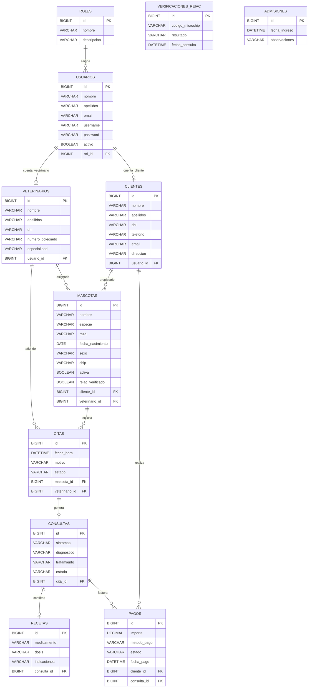

# Diagrama entidad-relacion

Responsable documentacion de diseno: David Martinez - G8.

Modelo relacional usado por la aplicacion.

## Reglas de integridad principales

- `usuarios.username` y `usuarios.email` deben ser unicos.
- `roles.nombre` contiene el nombre tecnico usado por Spring Security.
- Una mascota debe pertenecer a un cliente.
- Una cita debe tener mascota y veterinario.
- Una consulta debe estar asociada a una cita.
- Una receta debe estar asociada a una consulta.
- Un pago debe pertenecer a un cliente.
