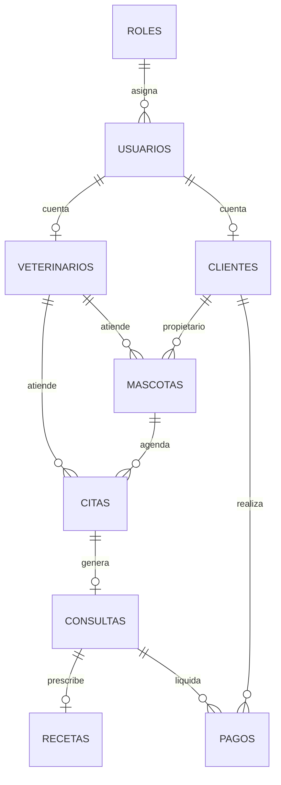

# Modelo de base de datos

Responsable documentacion BBDD: Reda El QOURCHI - G8.

El modelo final usado por la aplicacion Spring Boot normaliza el DER original a nombres plurales coherentes con las entidades Java.



## Incongruencia resuelta

El SQL externo `BaseDatosClinicaVeterinaria.sql` usa `propietario`, `mascota`, `veterinario`, `ficha` y `usuarios.id_cuenta`. El backend actual usa `clientes`, `mascotas`, `veterinarios`, `consultas` y `usuarios.id`.

Se mantiene el modelo del backend porque:

- Ya esta integrado con JPA.
- Evita cambios masivos de entidades y controladores.
- Es mas consistente con el frontend multipagina actual.

El esquema ejecutable esta en:

```text
src/main/resources/schema.sql
```
